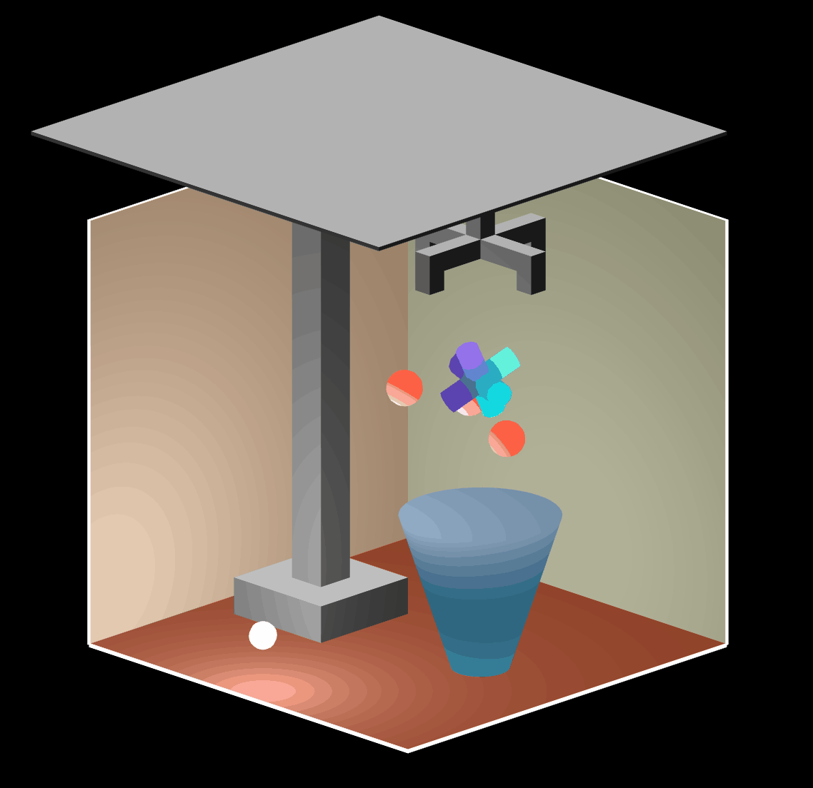

# Real-Time Rendering
Andrew Wong  
Wong.816@osu.edu

---
## Files
---
The project consists of the following files:

    - index.html
    - glMatrix-0.9.5.min.js
    - shader_setup.js
    - init_buffers.js
    - transformation.js
    - scene.js

The code was developed on Windows 11 using Firefox.

---
## Usage
---
The scene is of a floating particle in a room. The particle's nucleus has three sub-particles orbiting it.

The player controls the particle. The controls are as follows:

    - W:            move forward
    - A:            move left
    - S:            move backward
    - D:            move right
    - Left-Arrow:   rotate left
    - Right-Arrow:  rotate right
    - Up-Arrow:     raise
    - Down-Arrow:   lower

The camera can be controlled using the following commands:

    - P/p:  pitch
    - Y/y:  yaw
    - R/r:  roll

The light source can be moved in the world space using the following commands:

    - J/j:  X-axis
    - K/k:  Y-axis
    - L/l:  Z-axis